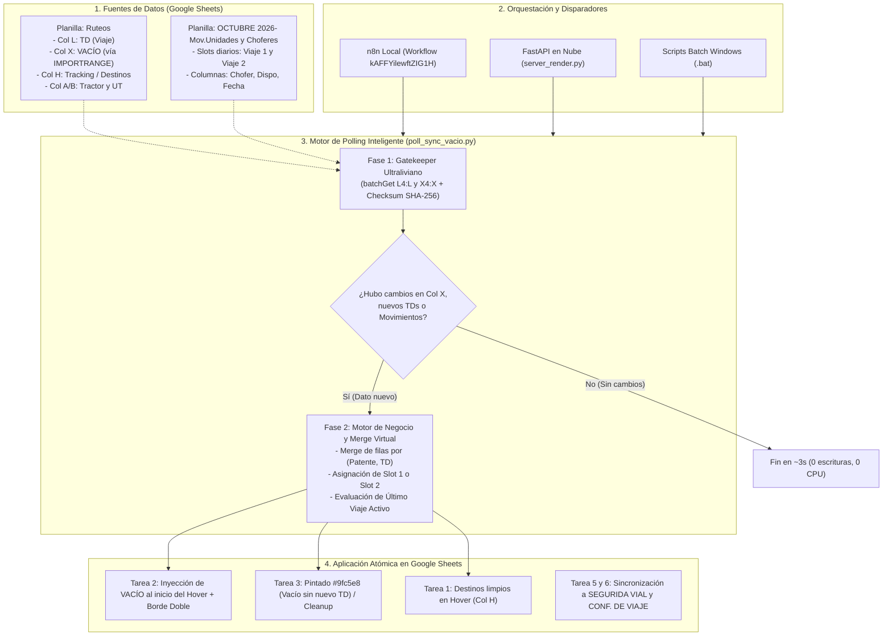

# 🚀 Central Operativa Diaria: Sincronizaciones, Polling Inteligente & Orquestación

Repositorio centralizado que consolida todas las integraciones, reglas de negocio, sincronizadores y motores de orquestación operativa entre las planillas de **Ruteos** y **Movimientos Mensuales**:
📁 `C:\Users\Matias Rodriguez\Documents\diaria`

Diseñado para operar de forma híbrida: **100% autónomo en entorno local (Windows)** o en la nube (**Render Cloud**) con soporte para n8n, API REST y CLI.

---

## 📑 Tabla de Contenidos
1. [Arquitectura y Flujo de Datos](#-arquitectura-y-flujo-de-datos)
2. [Motor de Polling Inteligente (Gatekeeper + Merge)](#-motor-de-polling-inteligente-gatekeeper--merge)
3. [Matriz Detallada de Tareas y Procesos (1 a 7)](#-matriz-detallada-de-tareas-y-procesos)
4. [¿Por qué el Merge de TD y Patente es Mandatorio?](#-por-qué-el-merge-de-td-y-patente-es-mandatorio)
5. [Métricas de Consumo y Cuotas de Google API](#-métricas-de-consumo-y-cuotas-de-google-api)
6. [Orquestación: n8n, FastAPI (Render) y CLI Local](#-orquestación-n8n-fastapi-y-cli-local)
7. [Guía de Comandos y Scripts .bat](#-guía-de-comandos-y-scripts-bat)

---

## 🌐 Arquitectura y Flujo de Datos



---

## ⚡ Motor de Polling Inteligente (Gatekeeper + Merge)

### El Desafío del `IMPORTRANGE`
La Columna X de `Ruteos` se nutre mediante una fórmula `=IMPORTRANGE(...)`. En el ecosistema de Google Sheets, ni `onEdit` ni `onChange` se activan cuando una fórmula recalcula datos externos. Un cron tradicional que descargue toda la matriz operativa cada 5 minutos consume recursos masivos (Ruteos supera las **17.800 filas**).

### La Solución: Arquitectura en 2 Fases (`poll_sync_vacio.py`)

#### Fase 1: Gatekeeper Ultraliviano (Detección en ~3 seg)
1. **Consulta mínima atómica**: Realiza una sola llamada `spreadsheets.values.batchGet` solicitando exclusivamente:
   * `Ruteos!L4:L`: Columna de TDs (detecta nuevos viajes cargados).
   * `Ruteos!X4:X`: Columna de VACÍO (detecta nuevos reportes de vacío o modificaciones de hora).
   * Columnas del día activo en `Movimientos` (detecta asignaciones manuales de chofer o cambios de disponibilidad).
2. **Firma criptográfica (Checksum SHA-256)**: Se genera un hash determinista a partir de los datos no vacíos y los últimos registros operativos.
3. **Comparación contra caché (`last_poll_state.json`)**:
   * **Si el hash es idéntico**: El proceso aborta inmediatamente en ~3-5 segundos. **Cero escrituras en Google Sheets, cero consumo de memoria pesado.**
   * **Si el hash difiere**: Se detectó una novedad real y se activa la Fase 2.

#### Fase 2: Ejecución Completa con Merge Virtual
Se lanzan los sincronizadores oficiales con sus reglas de negocio avanzadas:
* `sync_vacio.py --apply --borders` (Tarea 2)
* `sync_seguimiento_vacio.py --apply` (Tarea 3)
* Tras completar la sincronización, se persiste la nueva huella digital en `last_poll_state.json`.

---

## 🔍 ¿Por qué el Merge de TD y Patente es Mandatorio?

Cuando se detecta un dato nuevo en la Columna X, **no basta con leer esa celda de forma aislada**. El cruce relacional entre TD y Patente es obligatorio por tres motivos estructurales:

1. **Paradas múltiples por remito (Un TD en varias filas)**:
   * En `Ruteos`, un tractor realizando un viaje con TD `1281428` suele tener 2 o 3 filas consecutivas si realiza entregas en distintas localidades.
   * El reporte de VACÍO en la Columna X se carga habitualmente en una sola fila (la última parada).
   * El algoritmo agrupa virtualmente todas las filas que comparten `(Patente, TD)` para consolidar el horario de vacío con todas las localidades recorridas.

2. **Regla de "Vacío sin nuevo TD" (Tarea 3 - Pintado `#9fc5e8`)**:
   * Para saber si una unidad debe pintarse de celeste o limpiarse, el sistema debe conocer si el viaje con reporte de vacío es el **último viaje cronológico** del camión.
   * Si para esa misma patente ya se registró un **nuevo TD posterior** en Ruteos (aunque todavía no tenga vacío), el camión ya fue asignado a otro servicio: **no debe pintarse** o debe ejecutarse el **cleanup automático** para quitar el color.

3. **Asignación de Slot en la Planilla Mensual (Viaje 1 vs Viaje 2)**:
   * Cada día en `OCTUBRE 2026- Mov.Unidades y Choferes` dispone de 2 slots de columnas. El merge por TD determina con precisión matemática si el vacío corresponde al Slot 1 o al Slot 2 evitando sobreescribir datos de otros viajes.

---

## 📋 Matriz Detallada de Tareas y Procesos

| # | Tarea / Módulo | Script Principal | Frecuencia / Modo | Objetivo y Mecanismo en Google Sheets |
|---|---|---|---|---|
| **1** | **Tracking Hover (Col H)** | `sync_ruteos_movimientos.py` | Cron 15m / Polling | Lee destinos limpios de Col H en Ruteos y los inserta como **notas en hover** en las celdas de fecha de Movimientos sin pisar información existente. |
| **2** | **VACÍO con Bordes (Col X)** | `sync_vacio.py` | Polling Inteligente / Cron 20m | Formatea la fecha de vacío (`VACIO d/m h:mm hs`) y la inyecta al **inicio de la nota en hover** (conservando el tracking). Aplica **borde inferior doble (`SOLID_MEDIUM`)** para identificación visual inmediata. |
| **3** | **Seguimiento Vacío (#9fc5e8)** | `sync_seguimiento_vacio.py` | Polling Inteligente / Cron 15m | Pinta de celeste (`#9fc5e8`) la celda del día si la unidad reportó vacío y no tiene TD posterior. Excluye localidades no operativas (Dock Sud, TDS, TLC, TLP, TVM, PP) y respeta colores manuales de operadores. Incluye **cleanup automático**. |
| **4** | **Disponibilidad VTV** | `pintarDisponibilidad.js` | Diario 06:00 AM | Evalúa vencimientos de VTV/Ruta de tractores y semirremolques, coloreando el semáforo diario de 33 columnas en Movimientos. |
| **5** | **Viajes Cordillera** | `main.py --seguridad-vial` | Cron 10m | Filtra viajes con destinos en las 21 localidades cordilleranas reglamentadas e inserta los registros en la pestaña `SEGURIDA VIAL`. |
| **6** | **CONF. DE VIAJE** | `main.py --conf-viaje` | Cron 10m | Monitorea la Columna W ('sujeto a seguimiento') en Ruteos y vuelca los despachos activos a la hoja `CONF. DE VIAJE`. |
| **7** | **Limpieza VACÍO (Reset)** | `limpiar_vacio.py` | Manual / Exclusivo | Script de mantenimiento que remueve notas de VACÍO y bordes dobles restaurando el estado original ante errores operativos. |

---

## 📊 Métricas de Consumo y Cuotas de Google API

### Límites de Google Sheets API v4 (Google Cloud Project)
* **Lectura**: 300 peticiones por minuto por proyecto (60 req/min por usuario).
* **Escritura**: 300 peticiones por minuto por proyecto (60 req/min por usuario).

### Comparativa de Consumo Diario: Cron Tradicional vs Polling Inteligente

```
Consumo Diario de Peticiones Google API (Lectura):
Cron 5m Continuo:        [████████████████████████████████████████] ~2.880 peticiones / día
Polling Inteligente:     [██████░░░░░░░░░░░░░░░░░░░░░░░░░░░░░░░░] ~400 - 600 peticiones / día  (-80%)

Tiempo de CPU / Servidor Diario:
Cron 5m Continuo:        [████████████████████████████████████████] ~216 minutos de procesamiento
Polling Inteligente:     [████░░░░░░░░░░░░░░░░░░░░░░░░░░░░░░░░░░] ~18 minutos de procesamiento  (-91%)
```

* **Horas no operativas (Noche / Fines de Semana)**:
  * Cron tradicional: Sigue ejecutando 288 lecturas pesadas y gastando cuota.
  * Polling Inteligente: El Gatekeeper resuelve en ~3s con 1 sola lectura liviana y **0 escrituras**.
* **Protección contra Error 429 (`Resource Exhausted`)**: Al centralizar Tarea 2 y Tarea 3 bajo el mismo poller, se eliminan las colisiones de concurrencia donde dos scripts intentan escribir en Movimientos al mismo segundo.

---

## 🛠️ Orquestación: n8n, FastAPI y CLI Local

### 1. n8n Local (`http://localhost:5678/workflow/kAFFYilewftZIG1H`)
* Workflow: `Operativas Integradas - Cordillera, Movimientos & Disponibilidad (Cloud & Local)`.
* En lugar de dos nodos separados ejecutando `sync_vacio.py` y `sync_seguimiento_vacio.py` cada 5m en simultáneo, se puede ejecutar el comando unificado:
  ```bash
  cmd /c "cd /d C:\Users\Matias Rodriguez\Documents\diaria && py -3.13 poll_sync_vacio.py --apply --borders"
  ```

### 2. FastAPI en Render Cloud (`server_render.py`)
Expone endpoints REST para activar tareas bajo demanda o integrarlas a webhooks externos:
* `POST /sync/poll-vacio`: Ejecuta el Polling Inteligente con Gatekeeper. Parámetros opcionales: `?day=N&force=true`.
* `POST /sync/vacio`: Dispara Tarea 2 directa.
* `POST /sync/seguimiento-vacio`: Dispara Tarea 3 directa.
* `POST /sync/tracking`: Dispara Tarea 1 directa.
* `POST /sync/all`: Corre el pipeline completo.
* `GET /status` y `GET /health`: Monitoreo del estado y duración de la última corrida de cada tarea.

---

## 💻 Guía de Comandos y Scripts .bat

### Ejecución con Archivos Batch (.bat)
* **`run_poll_vacio.bat`**: Ejecuta el Polling Inteligente de Vacío y Seguimiento con aplicación de cambios y bordes.
* **`run_all_syncs.bat`**: Disparador maestro de todas las tareas (1 a 6).
* **`run_sync_vacio.bat`**: Corre Tarea 2 directa.
* **`run_sync_seguimiento_vacio.bat`**: Corre Tarea 3 directa.
* **`run_sync_tracking.bat`**: Corre Tarea 1 directa.
* **`run_limpiar_vacio.bat`**: Ejecuta la herramienta de reseteo / limpieza de notas de vacío.

### Ejecución por Línea de Comandos (CLI)

```bash
# 1. Polling Inteligente (Modo Simulación / Dry-run)
py -3.13 poll_sync_vacio.py

# 2. Polling Inteligente aplicando cambios reales con bordes dobles
py -3.13 poll_sync_vacio.py --apply --borders

# 3. Forzar ejecución completa ignorando el estado previo
py -3.13 poll_sync_vacio.py --apply --force

# 4. Modo Observador Continuo (Daemon cada 60 segundos)
py -3.13 poll_sync_vacio.py --apply --borders --watch --interval 60

# 5. Filtrar por un día específico del mes (ej. Día 9)
py -3.13 poll_sync_vacio.py --apply --day 9
```

---

## 🔇 Modo Silencioso en n8n: Diferencia entre `py` y `pyw` & Procedimiento de Rollback

### 1. ¿En qué se diferencian `py.exe` y `pyw.exe`?

Ambos son binarios oficiales distribuidos por Python Software Foundation ubicados en `C:\Windows\`:

| Característica | `py -3.13` (Estándar) | `pyw -3.13` (Windowless / Silencioso) |
| :--- | :--- | :--- |
| **Subsistema PE de Windows** | `IMAGE_SUBSYSTEM_WINDOWS_CUI` (Console UI) | `IMAGE_SUBSYSTEM_WINDOWS_GUI` (Windowless) |
| **Comportamiento Visual** | Windows **asigna y abre una ventana negra de CMD** cada vez que se dispara. | Windows **no abre ninguna ventana**. Corre 100% invisible en segundo plano. |
| **Entorno de Python** | Python 3.13 idéntico, mismos módulos instalados. | Python 3.13 idéntico, mismos módulos instalados. |
| **Captura de Logs en n8n** | Redirige `stdout`/`stderr` a los pipes de Node.js. | Redirige `stdout`/`stderr` a los pipes de Node.js exactamente igual. |
| **Uso Ideal** | Terminal interactiva de desarrollo y depuración manual. | Tareas programadas en segundo plano (Cron, n8n, servicios). |

> **Nota sobre los logs:** Usar `pyw` **NO pierde ningún registro**. La salida de texto (`stdout`), los errores (`stderr`) y los códigos de salida (`exitCode`) siguen siendo leídos y procesados en su totalidad por n8n en cada nodo de `Execute Command` y en los nodos `Resumen`.

---

### 2. ¿Cómo inspeccionar logs sin abrir consolas?
* **Desde n8n**: En la vista de ejecuciones (`http://localhost:5678/workflow/.../executions/...`), haz clic sobre el nodo `Ejecutar Polling Inteligente` o `Resumen Polling Inteligente` para ver el JSON con el log completo.
* **Desde archivos locales**:
  * [`last_poll_state.json`](./last_poll_state.json): Estado de la última verificación del Gatekeeper.
  * [`last_sync_result.json`](./last_sync_result.json): Detalle de filas copiadas, errores y tiempos.
  * [`reportes/REPORTE_POLLING_INTELIGENTE.md`](../reportes/REPORTE_POLLING_INTELIGENTE.md): Reporte de auditoría en vivo.

---

### 3. Procedimiento de Rollback (Volver a ver ventanas de CMD)

Si en algún momento deseas depurar y ver visualmente la ventana negra emergiendo en pantalla con sus `print()` en vivo:

#### Opción A: Rollback manual en n8n
En el lienzo de n8n, abre cualquier nodo de `Execute Command` y cambia `pyw` por `py`:
* **Modo silencioso actual:**
  ```bash
  cmd /c "cd /d C:\Users\Matias Rodriguez\Documents\diaria && pyw -3.13 poll_sync_vacio.py --apply --borders"
  ```
* **Rollback visible:**
  ```bash
  cmd /c "cd /d C:\Users\Matias Rodriguez\Documents\diaria && py -3.13 poll_sync_vacio.py --apply --borders"
  ```

#### Opción B: Ejecución directa por Batch (.bat)
Los archivos batch interactivos (`run_poll_vacio.bat`, `run_all_syncs.bat`) utilizan `py -3.13` para que puedas correrlos con doble clic y ver la consola abierta con los logs completos en cualquier momento.

---
*Central Operativa Diaria © 2026 — Arquitectura de Sincronización y Automatización Logística.*

